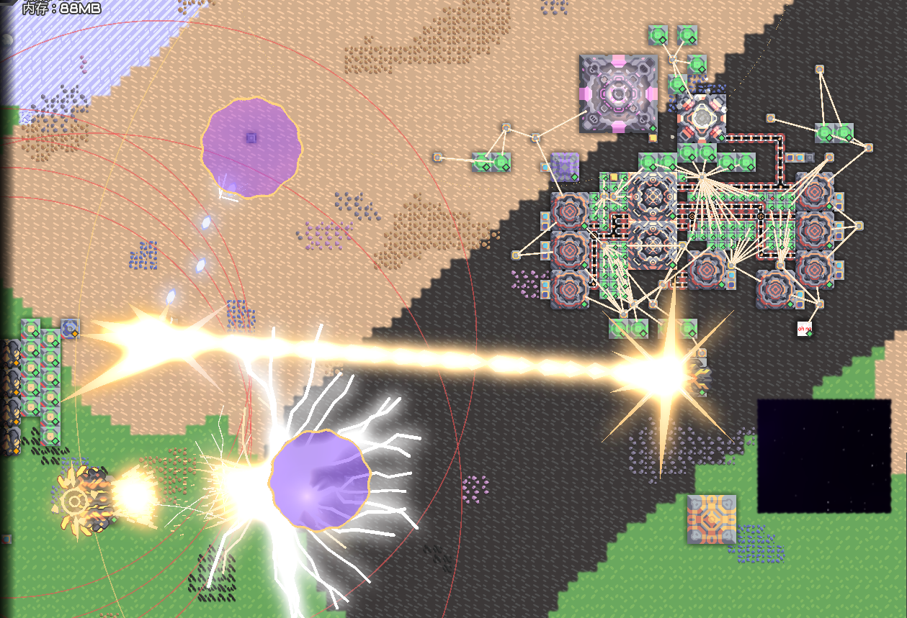

> [中文](README.md) / [English](README_EN.md)

# 虚空盾

> 一个由 Kotlin 编写，参考战锤 40K 虚空盾的全新护盾系统。

---

## ✨ 特性

- **全新的指令集** — 护盾控制自由度大幅提升
- **全新的热量系统** — 与原版截然不同的热量管理体验
- **全新的护盾机制** — 令人焕然一新的玩法

> ⚠️ 需要一定的逻辑基础

---

## 🎮 你可以

1. 创建自定义形状的护盾
2. 通过逻辑处理器控制护盾
3. 通过建筑堆叠与逻辑优化，不断升级护盾

---

## 📖 游玩指南

1. 建造 **虚空之心**、**帷幕溶解器**、**空间穿刺机**，以及一个用于控制系统的**逻辑处理器**
2. 为系统搭建独立的散热线路
3. 编写控制逻辑

---

## 📝 逻辑编写指南

1. 使用 `CircleZone`（或其他 Zone 指令）创建一个场
2. 使用 `UseZone` 将该场加载到对应建筑
3. 使用 `UpdateZone` 控制该场

> 如需护盾阻挡子弹：使用 `Bind` 将帷幕溶解器绑定到空间穿刺机，然后使用 `AutoBlock` 开启自动拦截。

这套逻辑将在未来继续扩展。

---

## 🚧 开发状态

目前 Mod 仍在开发测试中，欢迎提交 Issue！

---

## 👥 制作人员

| 角色 | 作者 |
|------|------|
| 代码编写 | ZXS |
| 贴图制作 | 花杨永瀛 |
| 委托 | 一得阁拉米 |
